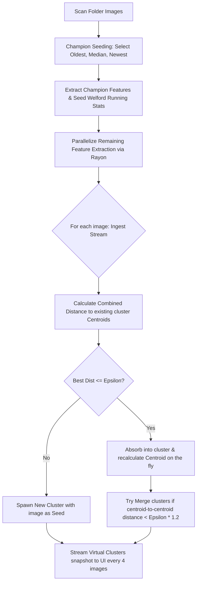

# BildBlitz ⚡ — Technical & Architectural Specification

**BildBlitz** is a high-performance, native image browser and library manager written in **Rust (Edition 2024)** for Windows 10/11. It implements a fully multi-threaded, asynchronous architecture built around the `egui` immediate-mode GUI framework, the `tokio` async runtime, and the `rayon` data-parallelism framework.

This document details the software design, concurrency models, clustering mathematics, data storage layers, and rendering strategies that form the BildBlitz engine.

---

## 📐 Overall System Topology

The application divides duties between a low-latency UI rendering thread and background worker threads, communicating via asynchronous message-passing channels (`mpsc`):

```mermaid
graph TD
    A[main.rs: Entry Point] --> B[eframe UI Thread]
    A --> C[Actix-Web API Server :8080]
    A --> D[sqlx SQLite Database Engine]

    subgraph UI Thread Loop (egui/eframe)
        B --> B1[Left/Right Grid Views]
        B --> B2[Dockable Grouping Sidebar]
        B --> B3[Live Audit Telemetry View]
        B --> B4[Fullscreen Prefetched Gallery]
    end

    subgraph Async Tokio Background Workers
        E[Scanner Task] -->|ScanResult| B
        F[AutoGroup Task] -->|Progress/Result| B
        G[Thumbnail Manager] -->|ThumbnailResult| B
        H[Full Image Manager] -->|FullImageResult| B
    end

    subgraph Rayon Parallel Thread Pool
        I[Parallel Color & PHash Extractor]
    end

    F -->|Spawns Work| I
    G -->|Spawns Work| I
    D <--->|Reads/Writes| E
    D <--->|Reads/Writes| F
    D <--->|REST Queries| C
```

---

## ⚡ Concurrency & Messaging Model

To prevent immediate-mode UI freezes, BildBlitz implements **Strict Thread Separation**. The UI thread does not perform disk operations, EXIF parsing, or classification math. Instead, tasks are dispatched to background thread pools and results are received asynchronously.

### 1. The Channel Hub (`ChannelHub` in `app.rs`)
Thread communication is managed via a centralized registry of bounded channels (`tokio::sync::mpsc`):
* `thumb_rx` / `thumb_tx`: Streams resized and raw-decoded visual thumbnails from the background cache.
* `scan_rx` / `scan_tx`: Signals the completion of directory crawlers, providing file vectors and invalidation markers.
* `hd_rx` / `hd_tx`: Delivers decoded full-resolution textures for the fullscreen viewer.
* `backend_rx` / `backend_tx`: Standardized enum command protocol (`BackendMsg`) directing backend workers to start clustering, commit folders, or apply transformations.
* `ag_prog_rx` / `ag_prog_tx`: Tracks live classification steps to drive UI progress bars.
* `audit_rx` / `audit_tx`: Directs system tracing metrics (success, latencies, error states) into the live diagnostics panel.

### 2. Immediate-Mode Event Loop Integration
Because `egui` only repaints upon receiving input events, background threads call `ctx.request_repaint()` after pushing messages onto channels. This wakes up the event loop to instantly drain incoming buffers and update the display.

---

## 🧠 The ML Grouping Engine: Champion-Seeded Online Leader Clustering

Located in `src/engine/auto_group.rs`, the clustering system groups raw images into structured visual collections.



### 1. Multi-Dimensional Feature Vector
Each image is represented by a composite feature vector:
$$\mathbf{x} = \left[ t, L, a, b, ar, \text{phash}, \text{palette} \right]$$
* **Time ($t$):** EXIF creation timestamp.
* **Luminance & Chrominance ($L, a, b$):** Lightness, red-green, and blue-yellow channels in the perceptually uniform **CIELAB** color space, averaged across a $32 \times 32$ downsampled thumbnail.
* **Aspect Ratio ($ar$):** Dimensional width divided by height.
* **Perceptual Hash ($\text{phash}$):** A 64-bit base64-decoded bitstring representing structural layout.
* **Palette ($\text{palette}$):** $8$ primary dominant colors extracted using **K-Means quantization** inside the Lab space.

### 2. Welford's Algorithm & Champion Seeding
To normalize features with vastly different scales (e.g., timestamps in the millions vs. lightness between 0 and 100), the engine calculates **online Z-scores**:
$$z = \frac{x - \mu}{\sigma}$$
Standard deviation ($\sigma$) and mean ($\mu$) are computed on-the-fly using **Welford's Running Statistics algorithm**, preventing numerical overflow. 

Prior to streaming, the engine selects **three champion images** (the oldest, newest, and median files by modification date). Their features are extracted first to bootstrap the initial running mean and standard deviation, preventing variance collapse during the early ingestion phase.

### 3. Composite Distance Function
The distance between image vector $\mathbf{v}_1$ and cluster centroid $\mathbf{v}_2$ is defined by:
$$D(\mathbf{v}_1, \mathbf{v}_2) = \sqrt{\sum_{i=0}^{4} w_i (z_{1,i} - z_{2,i})^2} + d_{H}(\text{phash}_1, \text{phash}_2) \cdot w_{\text{phash}} + d_{P}(\text{pal}_1, \text{pal}_2) \cdot w_{\text{pal}}$$
* **Weighted Euclidean Distance:** Applied over normalized continuous dimensions (time, $L$, $a$, $b$, aspect ratio) where weights ($w_i$) are controlled by user sliders.
* **Hamming Penalty ($d_H$):** Computes normalized Hamming distance on the 64-bit pHashes (XOR followed by population count). If structural layouts diverge, a weight-based distance penalty is added, preventing the grouping of visually distinct photos.
* **Palette Distance ($d_P$):** Computes the average Delta-E distance between the sorted 8-color centroids of both images.

### 4. Real-time Cluster Merging & UI Streaming
To ensure a fluid experience:
* **Dynamic Merging:** When an image is absorbed, it shifts the cluster's centroid. The manager checks if the updated centroid is within $\epsilon \cdot 1.2$ of any other cluster's centroid, merging them if necessary.
* **Partial Snapshots:** Every 4 ingested images, the background worker sends a `VirtualClustersUpdated` message containing a snapshot of the current grouping, allowing the user to watch the organization build in real-time.

### 5. Determinant Force Analysis ("White Box" Feedback)
After clustering, the engine calculates the normalized ratios of user-defined weights:
$$\text{Force}_{\text{dimension}} \% = \frac{w_{\text{dimension}}}{\sum w} \cdot 100$$
This translates the complex mathematical boundaries into three human-readable percentages (Time, Color, Composition), exposing the primary drivers behind the virtual collection formation.

---

## 🖼️ Memory Management & Caching Pipeline

Decoupling UI responsiveness from high-latency decoding relies on two customized caching layers powered by `moka` (a high-concurrency, thread-safe cache engine using the TinyLFU admission policy):

### 1. Thumbnail Cache (`ThumbnailManager`)
* Automatically downsamples images to a maximum bounding box of $160 \times 160$ pixels.
* Caches processed `egui::ColorImage` instances in memory, allowing instant rendering of the main explorer grid.
* Offloads file decoding to a `tokio` background worker, sending the result to the matching panel side (`Left` vs `Right`) to prevent tab crossover.

### 2. High-Resolution Cache & Prefetching (`FullImageManager`)
* Manages full-resolution image buffers for the gallery view.
* Implements **Predictive Prefetching**: When a user selects a file, the viewer anticipates traversal direction and commands background threads to decode the adjacent files ($N-1$ and $N+1$). Decoded textures are kept in the LRU cache, enabling instant panning and zero-delay slideshow transitions.

---

## 🗄️ Database & Schema Design

Located in `src/library/db.rs`, the persistent index uses `sqlx` over a local SQLite engine. The schema tracks directory contents, metadata cache, and virtual collections:

```sql
-- Main indexed images table
CREATE TABLE IF NOT EXISTS images (
    id INTEGER PRIMARY KEY AUTOINCREMENT,
    path TEXT NOT NULL UNIQUE,
    size INTEGER,
    modified INTEGER,
    exif_json TEXT,
    phash TEXT
);
CREATE INDEX IF NOT EXISTS idx_phash ON images(phash);

-- Virtual collections definitions
CREATE TABLE IF NOT EXISTS virtual_collections (
    id INTEGER PRIMARY KEY AUTOINCREMENT,
    name TEXT NOT NULL,
    created_at INTEGER NOT NULL
);

-- Many-to-many relationship mapping virtual grouping
CREATE TABLE IF NOT EXISTS collection_members (
    collection_id INTEGER NOT NULL,
    image_id INTEGER NOT NULL,
    FOREIGN KEY(collection_id) REFERENCES virtual_collections(id),
    FOREIGN KEY(image_id) REFERENCES images(id),
    UNIQUE(collection_id, image_id)
);
```

### Key DB Routines
* **Duplicates Finder:** Groups records by identical `phash` fields (filtering groups where count > 1) to populate the Duplicates Tab.
* **Metadata Persistence:** Stores parsed EXIF JSON blocks asynchronously to avoid re-parsing during subsequent scans.

---

## 🌐 Actix-Web API Server

Embedded in `src/server/mod.rs`, an Actix-web daemon binds to local loopback `127.0.0.1:8080` at launch:
* Exposes a `GET /stats` endpoint that queries the shared `DatabaseManager` pool, returning JSON-serialized details of indexed images and active virtual collections.
* Serves as an integration point for external python scripts, backup daemons, or remote curation interfaces.

---

## 📁 Lossless Transform Engine

Located in `src/library/transform.rs`, the application implements lossless JPEG transformations utilizing native mathematical operations on the underlying image matrix:
* **Rotate:** Executes 90° or 180° orientation adjustments.
* **Flip:** Executes horizontal and vertical mirror reflections.
* **Cache Invalidation Loop:** When a transformation succeeds, the engine invalidates the image's records in the SQLite database, purges the `moka` thumbnail and HD caches, and immediately commands background tasks to re-generate the textures, ensuring the UI reflects the modified file layout instantly.
